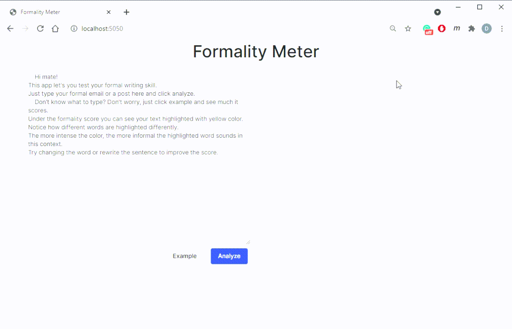

#  Formality Meter

Review how formal your writing is. Simply paste your text in the textbox and click `analyze`. Once the text is processed, you will see *"Formality Score"* (0% - 100%) and your text with some words or phrases highlighted. Highlighted wordes are the ones that make the text look informal. Try changing them to increase the formality score.

## Structure

This repo comes with the NLP API service to compute the formality score and basic web front-end to allow user interaction with the API. Hence, the installation can be split into 2 major steps: preparing the NLP model and local serving.

## How to install

- ### Prepare the environment
  1. Clone repo and move to the project directory
  2. Make sure python 3.x installed [official page](https://www.python.org/downloads/)
  3. Create virtual environment `python -m venv venv`
  4. Activate venv e.g. `source venv/bin/activate`
  5. Install required packages `pip sintall -r requirements.txt`
- ### Prepare NLP model
  1. Execute `python ./api/pack_service.py`. This python script downloads pretrained Bert model for formality classification and puts all the files needed for API service in the `./bundles/bundle`
- ### Serving 
  1. Execute `docker-compose up --build`. This command will build images for both API and Web front-end services and run them locally.
  2. Once the docker containers are running, open `http://localhost:5050/` in your browser to access the front-end or, alternatively, open `http://localhost:5000/` to get the UI for OpenAPI Spec of the NLP service.
 
